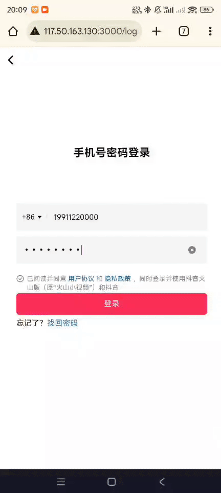

<h1 align="center">
  X-Tok-Backend
</h1>

## 简介 (Introduction)

该项目基于开源前端项目，采用 Go 语言开发后端，使用 Gin 框架构建，结合 MySQL 进行数据存储，并通过 Redis 实现鉴权 Token 的缓存管理。同时，集成 Gorse 提供推荐算法服务，基于 WebSocket 实现实时聊天功能。项目功能涵盖短视频的点赞、评论、收藏、分享以及用户关注和实时聊天等核心互动场景。后续将继续补充直播和其他功能。

This project is based on an open-source frontend project, developed in Go for the backend using the Gin framework. It integrates MySQL for data storage and Redis for authentication token caching. Additionally, it incorporates Gorse for recommendation algorithm services and implements real-time chat using WebSocket. Key features include short video interactions like likes, comments, favorites, shares, user following, and real-time chat. Future updates will include live streaming and additional features.

<p align="center">
  
  
  
  
  
</p>

---

## 目录 (Table of Contents)

- [在线访问 (Online Access)](#在线访问-online-access)
- [部署及运行 (Deployment & Run)](#部署及运行-deployment--run)
- [用法说明 (Usage)](#用法说明-usage)
- [技术交流 (Community)](#技术交流-community)
- [注意事项 (Notes)](#注意事项-notes)
- [许可证 (License)](#许可证-license)

---

## 在线访问 (Online Access)

**访问地址 (URL):**  
https://www.shortvideo.site

使用以下账号登录体验：  
**账号 (Phone):** 19911220000 *(非真实电话号码)*  
**密码 (Password):** 00000000

---

## 部署及运行 (Deployment & Run)

```bash
# 1. 克隆仓库(Clone the repository)
git clone https://github.com/GIS142857/douyin-backend.git

# 2. 进入项目目录(Enter the project directory)
cd douyin-backend

# 3. 安装依赖(Install dependencies)
go mod tidy

# 4. 数据库导入(Import the database)
mysql -u username -p db_douyin < database/db_douyin.sql

# 5. 修改配置文件 config.yaml、gorm_v2.yaml(Modify configuration files: config.yaml, gorm_v2.yaml)

# 6. 启动项目(Start the project)
go run cmd/web/main.go 

# 7. 启动前端项目 (参考前端项目中的方法)(Start the frontend project (refer to the frontend project's documentation))
```

## 用法说明 (Usage)
由于取消了前端的请求拦截以及将前端的很多代码做了修改，所以需要使用我修改过的前端代码进行部署，修改版的前端代码在这个 fork 的项目中：

Modified Frontend Repository: https://github.com/GIS142857/douyin.git


## 技术交流 (Community)
目前项目还需补充更多功能，欢迎提交 `PR`，非常感谢你对我们的支持！技术交流可以联系我的邮箱.

Feel free to submit PRs or reach out via email for any questions or suggestions:<a href="mailto:fridalongwayhk4@gmail.com">fridalongwayhk4@gmail.com</a>

## 注意事项 (Notes)
注意：本项目仅适用于学习和研究，不得用于商业使用。

Notes: This project is for learning and research purposes only and must not be used for commercial purposes.

## 许可证 (License)
本项目基于 MIT 许可证发布，详情请查看 [LICENSE](LICENSE)。

This project is licensed under the MIT License - see the [LICENSE](LICENSE) file for details.
